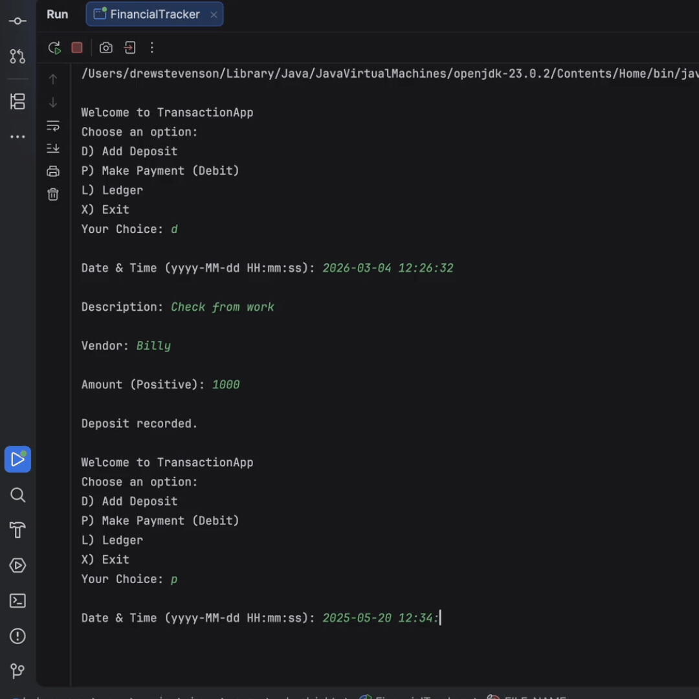

# Project Title
LedgerApp

## Description of the Project
This project is a personal finance tracker to help the user manage and organize their financial transactions. The program allows the user to record deposits and payments, store transactions in a CSV file and view transaction history through a ledger system.
This is a simple way for users to track income and expenses by being able to filter and view transactions. The user is also allowed to custom filter by date range, vendor, amount, and description.
The main purpose of this project is to help better monitor financial activity by keeping transaction records organized, searchable and easy to read.

## User Stories

- As a user, I want to be able to input my data, so that the application can process it accordingly.
- As a user, I want to receive immediate feedback, so I can understand what to do next.
- As a user, I want to enter my deposit information, so that it can be saved to the CSV file for future tracking and reporting.
- As a user, I want to enter my payment information, so that my payment transaction can be saved to the CSV file for future tracking and reporting.
- As a user, I want to access the ledger screen, so that I can view additional options and display transaction information stored in the file.
- As a user, I want an option to exit the application from the home screen, so that I can safely close the program when I am finished using it.
- As a user, I want to display all ledger entries, so that I can view the complete history of transactions stored in the application.
- As a user, I want to view only deposit transactions in the ledger screen, so that I can quickly see all money added to the account.
- As a user, I want to view only payment transactions in the ledger screen, so that I can quickly see all money deducted from the account.
- As a user, I want a Reports option in the ledger screen, so that I can search and filter transactions using different custom search categories.
- As a user, I want to perform a custom search using different filter options, so that I can find specific transactions that match my search category.

## Setup

1. Open IntelliJ IDEA.
2. Select New project or open the project folder that already exists.
3. Place the project files inside src → main → com.pluralsight.
4. If you already have a transactions.csv file place that in the project directory
5. Open the FinacialTracker.java file
6. Run the FinanicalTracker.main() by clicking the green button

### Prerequisites

- IntelliJ IDEA: Ensure you have IntelliJ IDEA installed, which you can download from [here](https://www.jetbrains.com/idea/download/).
- Java SDK: Make sure Java SDK is installed and configured in IntelliJ.

### Running the Application in IntelliJ

Follow these steps to get your application running within IntelliJ IDEA:

1. Open IntelliJ IDEA.
2. Select "Open" and navigate to the directory where you cloned or downloaded the project.
3. After the project opens, wait for IntelliJ to index the files and set up the project.
4. Find the main class with the `public static void main(String[] args)` method.
5. Right-click on the file and select 'Run 'YourMainClassName.main()'' to start the application.

## Technologies Used

- Java
- IntelliJ IDEA
- ArrayList
- BufferReader/writer, FileReader/writer
- LocalDate/Time/DateTime/DateTimeFormatter
- CSV File
- Git/GitHub

## Demo

## Future Work

- Make application more user-friendly
- Make easier to navigate
- Maybe make balance tracker to track how remaining funds

## Resources

- [File Exists](https://www.geeksforgeeks.org/java/file-exists-method-in-java-with-examples/)
- [Comparator.comparing](https://www.baeldung.com/java-8-comparator-comparing)
- [Reverse Array Sort](https://www.w3schools.com/jsref/jsref_reverse.asp)
- [Class LocalDateTime](https://docs.oracle.com/javase/8/docs/api/java/time/LocalDateTime.html)

## Thanks

- Thank you to Raymond for continuous support and guidance.
- A special thanks to all teammates for their dedication and teamwork.
 