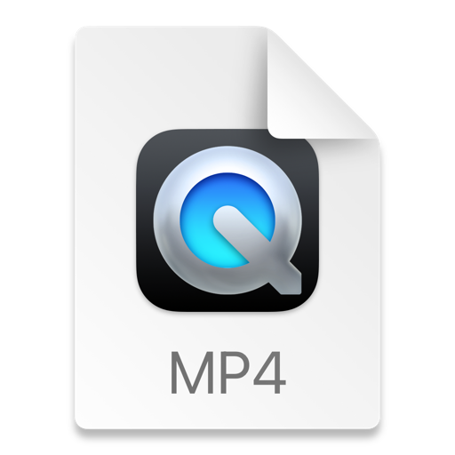

# Project Title
ledger-app
## Description of the Project
This project is a personal finance tracker to help the user manage and organize their financial transactions. The program allows the user to record deposits and payments, store transactions in a CSV file and view transaction history through a ledger system.
This is a simple way for users to track income and expenses by being able to filter and view transactions. The user is also allowed to custom filter by date range, vendor, amount, and description.
The main purpose of this project is to help better monitor financial activity by keeping transaction records organized, searchable and easy to read.

## User Stories

List the user stories that guided the development of your application. Format these stories as: "As a [type of user], I want [some goal] so that [some reason]."

- As a user, I want to be able to input my data, so that the application can process it accordingly.
- As a user, I want to receive immediate feedback, so I can understand what to do next.

## Setup
1. Open IntelliJ IDEA.
2. Select New project or open the project folder that already exists.
3. Place the project files inside src → main → com.pluralsight.
4. If you already have a transactions.csv file place that in the project directory
5. Open the FinacialTracker.java file
6. Run the FinanicalTracker.main() by clicking the green button

### Prerequisites

- IntelliJ IDEA: Ensure you have IntelliJ IDEA installed, which you can download from [here](https://www.jetbrains.com/idea/download/).
- Java SDK: Make sure Java SDK is installed and configured in IntelliJ.

### Running the Application in IntelliJ

Follow these steps to get your application running within IntelliJ IDEA:

1. Open IntelliJ IDEA.
2. Select "Open" and navigate to the directory where you cloned or downloaded the project.
3. After the project opens, wait for IntelliJ to index the files and set up the project.
4. Find the main class with the `public static void main(String[] args)` method.
5. Right-click on the file and select 'Run 'YourMainClassName.main()'' to start the application.

## Technologies Used

- Java: 23 Oracle OpenJDK 23.0.2 - aarch64
- Build System: Maven
- GroupID: com.pluralsight

## Demo

Include screenshots or GIFs that show your application in action. Use tools like [Giphy Capture](https://giphy.com/apps/giphycapture) to record a GIF of your application.

## Future Work

Outline potential future enhancements or functionalities you might consider adding:

- Additional feature to be developed.
- Improvement of current functionalities.

## Resources

List resources such as tutorials, articles, or documentation that helped you during the project.

- [Java Programming Tutorial](https://www.example.com)
- [Effective Java](https://www.example.com)

## Team Members

- **Name 1** - Specific contributions or roles.
- **Name 2** - Specific contributions or roles.

## Thanks

Express gratitude towards those who provided help, guidance, or resources:

- Thank you to [Mentor's Name] for continuous support and guidance.
- A special thanks to all teammates for their dedication and teamwork.
 